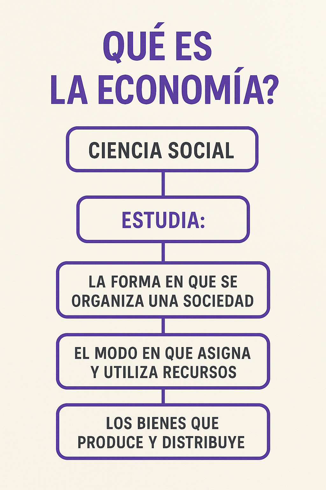
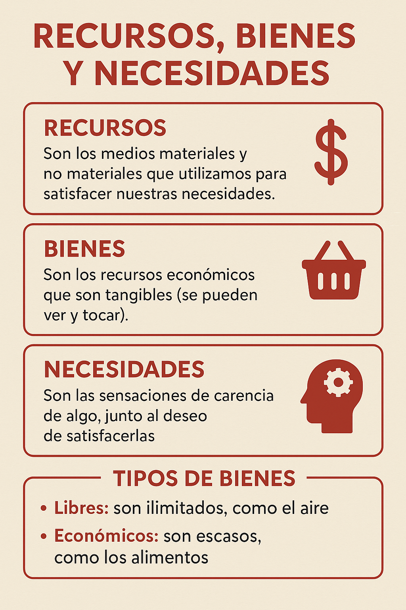
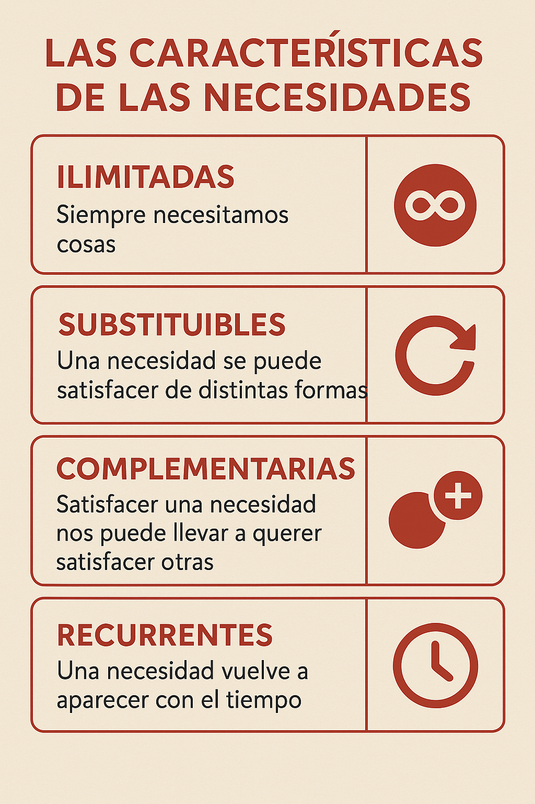
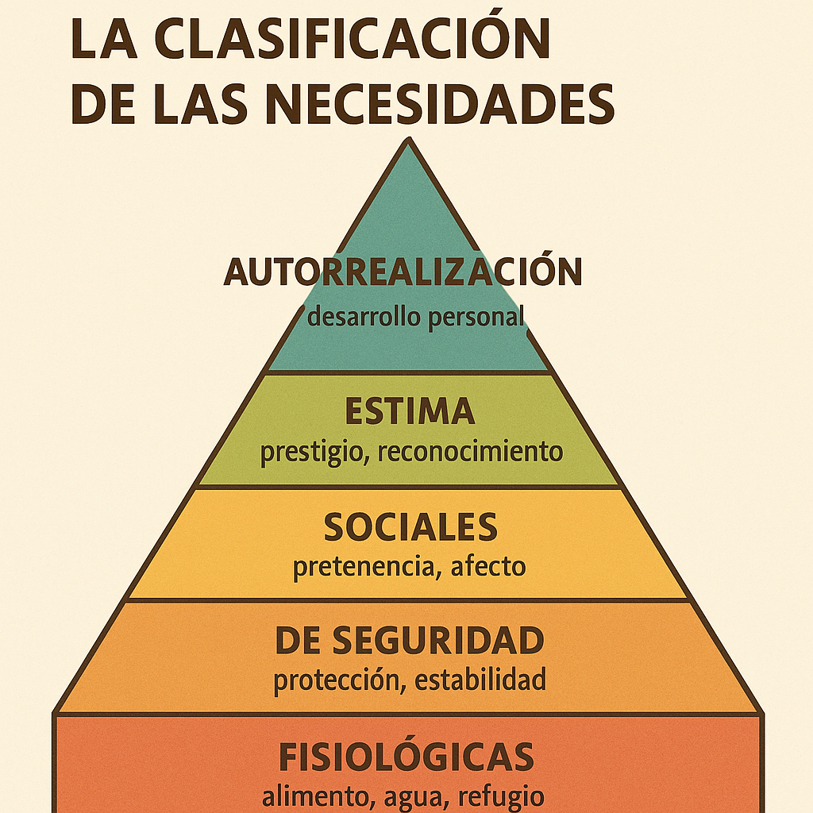
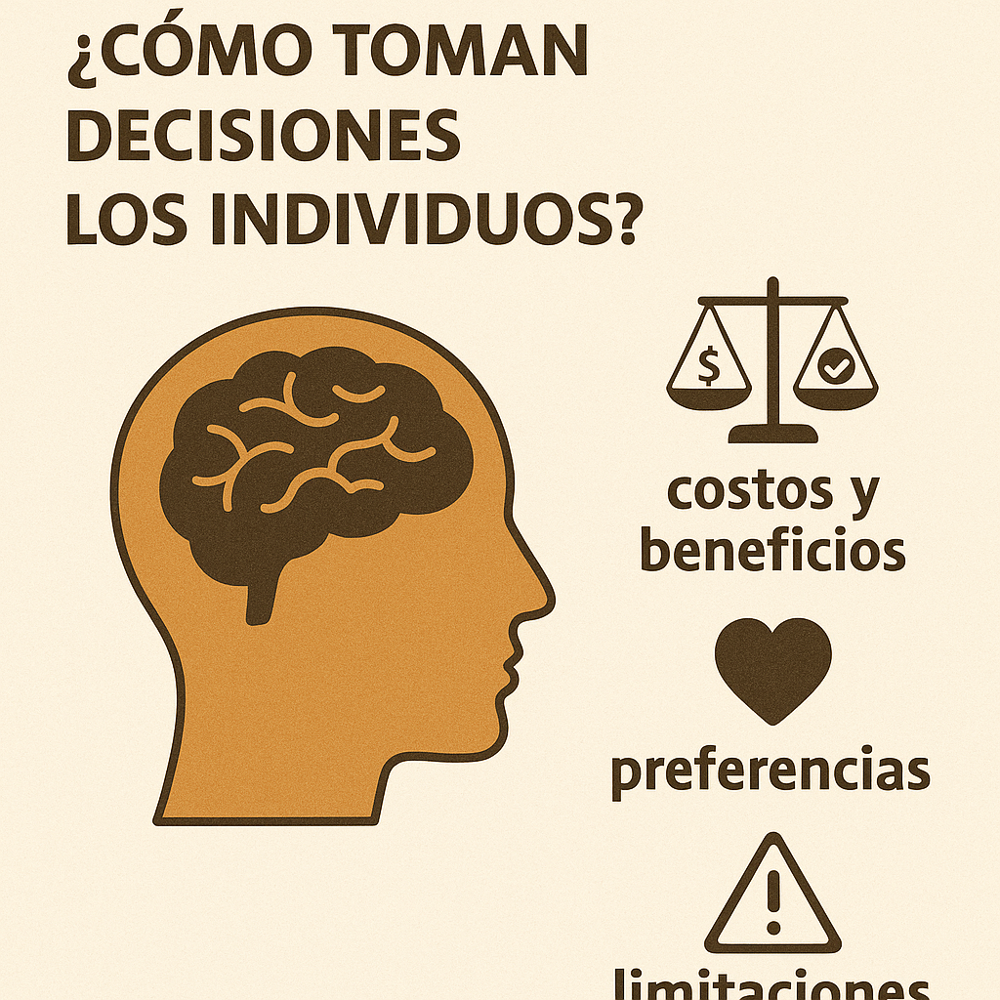
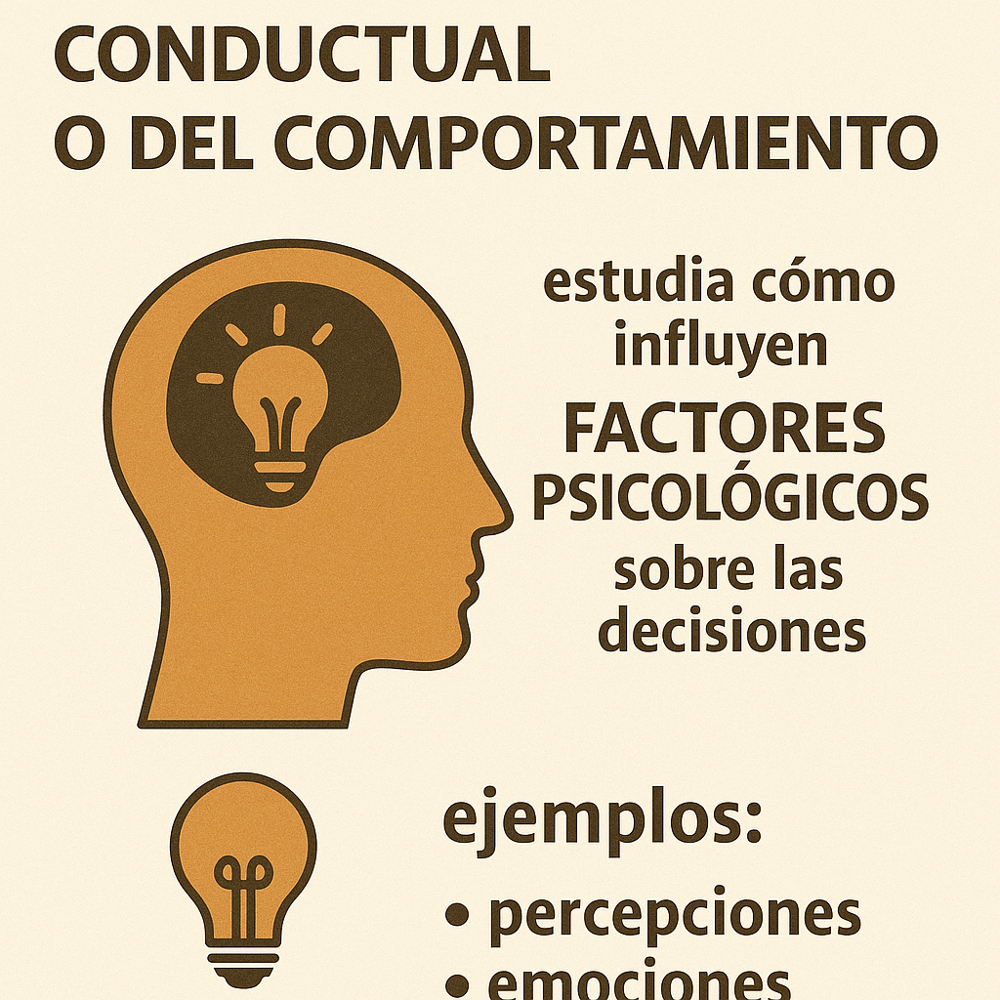

<!DOCTYPE html>
<html lang="es">
<head>
  <meta charset="UTF-8" />
  <meta name="viewport" content="width=device-width, initial-scale=1.0" />
  <title>Economía y Emprendimiento 4º ESO – IES El Raal</title>
  
</head>
<body>
  <header>
    <h1>Economía y Emprendimiento 4º ESO</h1>
    <h2>IES El Raal</h2>
  </header>

  

    
Decisiones económicas individuales

    

      
      <h3>1. ¿Qué es la Economía?</h3>
      
La ECONOMÍA es la ciencia que estudia cómo administrar unos recursos que son escasos para satisfacer la mayor cantidad posible de las necesidades de la sociedad.

      <ul>
        <li>Si no hubiera escasez de recursos (dinero, tiempo, materias primas, mano de obra, capital), no habría nada que administrar.</li>
        <li>Tampoco existiría la Economía si no hubiera que elegir entre alternativas para cubrir necesidades.</li>
        <li>Es la ciencia de la “escasez y elección”.</li>
        <li>Cada decisión personal o familiar, por pequeña que parezca, es en realidad un problema económico.</li>
      </ul>
      
Se puede decir que aprender Economía sirve tanto para mejorar las decisiones diarias (administración del presupuesto personal, gestión del tiempo de estudio) como para entender por qué el Estado o las empresas actúan de determinada manera.

      
Escasez: Recursos limitados para satisfacer todas las necesidades. Debido a dos motivos fundamentales: el tiempo y el dinero son limitados.

      
La Economía surge a partir de la contradicción entre la escasez de recursos (dinero y tiempo) y el carácter ilimitado de las necesidades humanas. Por ello, nos insta a tomar decisiones constantemente, sopesando alternativas y renunciando a otros usos posibles (coste de oportunidad).

      
La Economía se define como la ciencia que estudia cómo asignar recursos limitados para satisfacer el mayor número de necesidades posible. Este planteamiento sirve como base para entender tanto decisiones individuales (gastar, ahorrar, estudiar, trabajar) como fenómenos agregados del mercado y las políticas públicas.

      
      <h3>2. Recursos, Bienes y Necesidades</h3>
      
Recursos escasos: Son los factores productivos que permiten fabricar bienes y prestar servicios.

      <ul>
        <li>Recursos naturales: Elementos proporcionados por la naturaleza (semillas, tierra, agua, minerales, etc.).</li>
        <li>Trabajadores (mano de obra): Personas que realizan la producción (agricultores, obreros, técnicos, etc.).</li>
        <li>Capital físico: Maquinaria, herramientas y equipos necesarios para fabricar bienes o prestar servicios (tractores, fábricas, ordenadores, etc.).</li>
      </ul>
      
Escasez inherente: Ninguno de estos recursos existe en cantidad ilimitada; siempre habrá más usos posibles que la capacidad real de producción, por lo que debemos elegir cómo asignarlos para producir distintas mercancías.

      
Bienes y servicios: 
         Bien: Objeto físico o material que satisface una necesidad. 
         Servicio: Actividad que realiza una persona o una empresa para satisfacer una necesidad. 
      Diferencia: Los bienes satisfacen necesidades a través de un producto tangible y los servicios mediante una acción o labor.

      
Necesidades: Sensación de carencia unida al deseo de satisfacerla. Características: 
         - Carencia: Se detecta un faltante (hambre, sed, etc.). 
         - Deseo de satisfacción: Voluntad de cubrir la carencia.

      
Reproducción continua: Una vez satisfecha una necesidad, puede reaparecer otra distinta, lo que explica la prioridad en asignar recursos.

      
      <h3>3. Características de las Necesidades</h3>
      <ul>
        <li>Las necesidades son ilimitadas: se reproducen constantemente.</li>
        <li>La misma necesidad puede satisfacerse de varias maneras.</li>
        <li>Se sienten de manera diferente según la persona.</li>
        <li>Influyen factores como lugar, cultura, edad.</li>
        <li>No son fijas: evolucionan con la sociedad y circunstancias.</li>
      </ul>

      
      <h3>4. La Clasificación de las Necesidades de Maslow</h3>
      
Maslow clasificó las necesidades en una pirámide de cinco niveles:

      <ol>
        <li>Fisiológicas: alimentación, descanso, abrigo.</li>
        <li>Seguridad y protección: estabilidad, seguridad personal.</li>
        <li>Sociales: afiliación, afecto, pertenencia.</li>
        <li>Estima: reconocimiento, respeto, estatus.</li>
        <li>Autorrealización: máximo desarrollo personal.</li>
      </ol>
      
Solo emergen las necesidades superiores una vez cubiertas las inferiores.

      
      <h3>5. ¿Cómo toman decisiones los individuos?</h3>
      
Los agentes económicos realizan un análisis coste-beneficio racional:

      <ul>
        <li>Coste de oportunidad: renuncia a la siguiente mejor opción.</li>
        <li>Costes irrecuperables: ignorar gastos pasados.</li>
        <li>Análisis marginal: comparar beneficios y costes adicionales.</li>
        <li>Responden a incentivos: modifican comportamiento según recompensas o castigos.</li>
      </ul>

      
      <h3>6. La Economía Conductual o del Comportamiento</h3>
      
Combina economía y psicología para explicar decisiones reales:

      <ul>
        <li>Personas no siempre racionales: impulsos, emociones, heurísticos.</li>
        <li>Contraste Homo Sapiens vs Homo Economicus.</li>
        <li>Experimentos y teorías psicológicas.</li>
        <li>Aplicación a políticas públicas e incentivos.</li>
      </ul>
    

  

  

    
Actividades: Situaciones

    

      

        <iframe src="https://www.youtube.com/embed/b5bAUn0l3u4" allowfullscreen></iframe>
      

      <h3>Problema económico</h3>
      <ol>
        <li>Describe un día normal e identifica 3 acciones económicas.</li>
        <li>Si los recursos fueran ilimitados, ¿existiría la economía? Razona tu respuesta.</li>
        <li>Completa la siguiente tabla:</li>
      </ol>
      <table>
        <tr><th>NECESIDADES</th><th>PRODUCTO QUE LA SATISFACE</th><th>PRIMARIA / SECUNDARIA</th><th>NIVEL</th></tr>
        <tr><td></td><td></td><td></td><td>Fisiológicas</td></tr>
        <tr><td></td><td></td><td></td><td>Seguridad</td></tr>
        <tr><td></td><td></td><td></td><td>Social</td></tr>
        <tr><td></td><td></td><td></td><td>Estima</td></tr>
        <tr><td></td><td></td><td></td><td>Autorrealización</td></tr>
      </table>
    

  

  

    
Recursos Complementarios Audio y Comics

    

      <ul>
        <li><a href="https://open.spotify.com/episode/0a0a8CkkUZyZVxXQIqTsZM?si=1KvVPY4pQGaiB4bTLMcFlw" target="_blank">Podcast Introducción a la Economía</a></li>
        <li><a href="https://open.spotify.com/episode/6ipegx7vwmqC4sldjJSlwR?si=k9pB-GXnSiSi0YI3krcAhA" target="_blank">Podcast La Pirámide de Maslow</a></li>
        <li><a href="https://docs.google.com/file/d/0B7U9rS04YD_ETFZLZzFRUDdPams/edit?usp=sharing" target="_blank">Comic Historia de la Economía</a></li>
        <li><a href="https://docs.google.com/file/d/0B7U9rS04YD_EbEVPQm9xbDAycEk/edit?resourcekey=0-_qa_YDBuvrhmCoyIk2_39w" target="_blank">Comic Economía en media hora</a></li>
      </ul>
    

  

  

    
Recursos Complementarios Video

    

      

        

        

        

        

      

      

×
<iframe id="modalIframe" src="" allowfullscreen></iframe>

    

  

  

    
Lo importante no es participar

    

      
<a href="https://dashboard.blooket.com/set/64759c068e1d33de44450102" target="_blank">Blooket: Quiz</a> 
      <a href="https://play.kahoot.it/v2/lobby?quizId=b0b2dc87-7f41-4c6e-b66b-719743067349" target="_blank">Kahoot: Participar</a>

    

  

  
</body>
</html>
